# Manual tests - execution

## __1 - Pálya inicializáció ellenőrzése__

### __A teszt végén előállt pályakép:__
 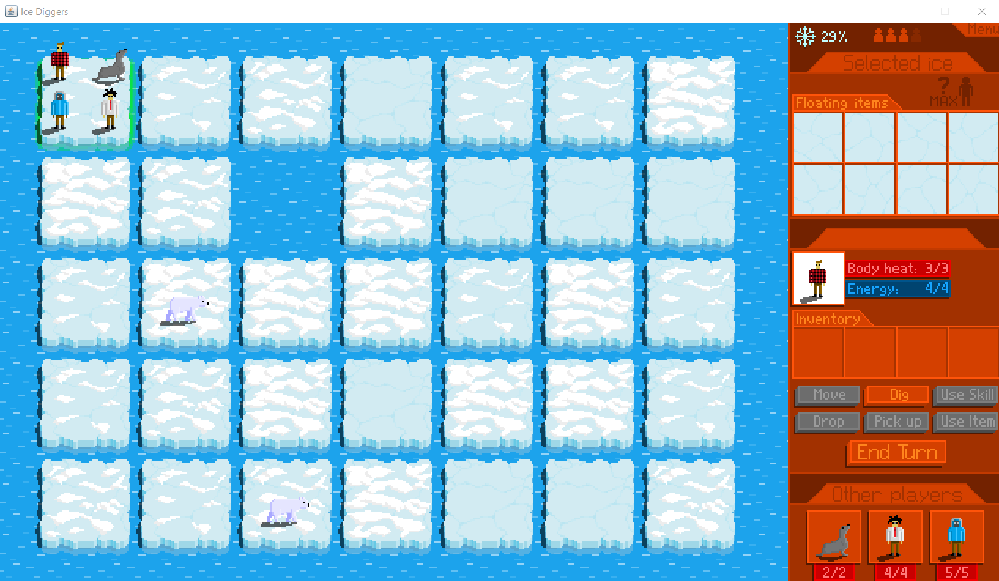


### __Megjegyzés:__
```
A teszt helyesen lefutott, a pálya megfelelően inicializálódott.
```
***

## __2 - Játékosok és körök váltakozása__

### __A teszt végrehajtása előtti pályakép:__
 

### __A teszt végén előállt pályakép:__
 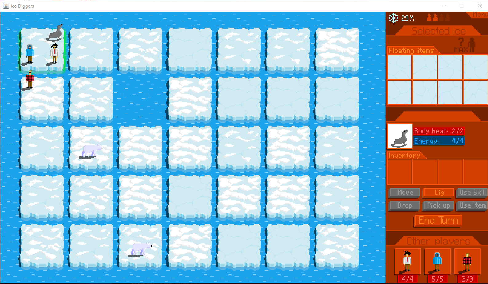


### __Megjegyzés:__
```
A teszt helyesen lefutott. A pályán, a játékos átléptetése után eggyel csökkent az `Energy` értéke, a hátralévő játékosok száma csökkent eggyel az `End Turn` megnyomása után, illetve a sorban következő játékos lett az aktuális, akinek a képe bekerült az előző játékos képének a helyére.
```
***

## __3 - Játékosok mozgásának megjelenítése__

### __A teszt végrehajtása előtti pályakép:__
 

### __A teszt végén előállt pályakép:__
 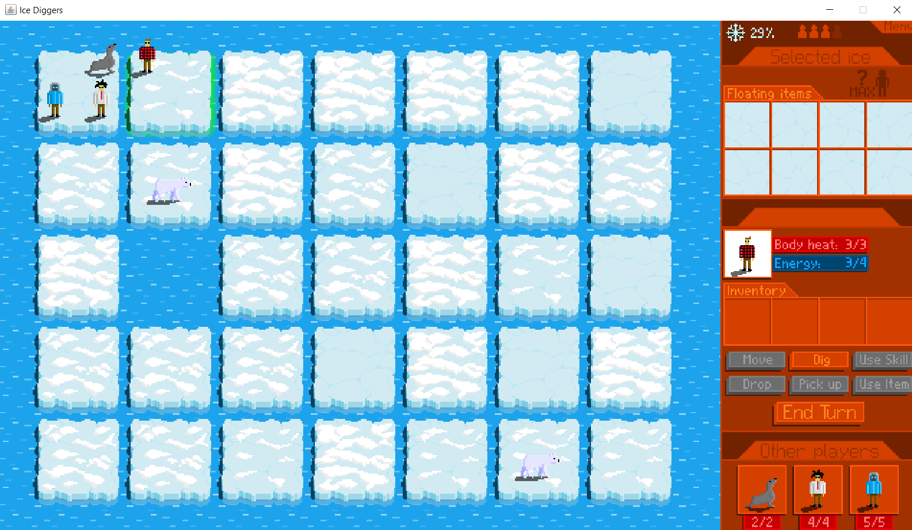


### __Megjegyzés:__
```
A teszt helyesen lefutott. A pályán, a játékos átkerült a `Move` megnyomása után az új mezőre.
```
***

## __4 - A játék mentése__

### __A teszthez a pálya előkészítése:__
 

### __A játék elmentése:__
 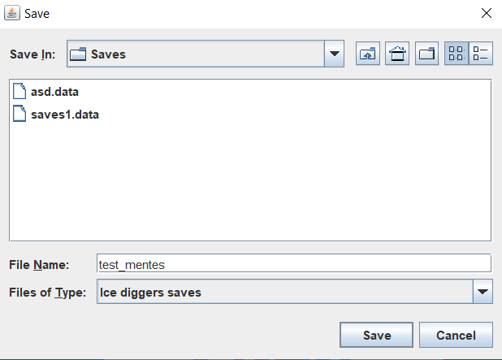

### __Az elmentett játékfájl:__
 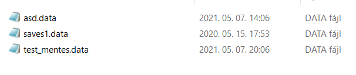


### __Megjegyzés:__
```
A teszt helyesen lefutott. A mentés után a kiexportált adatfájl megjelent a kiválasztott könyvtárban.
```
***

## __5 - A játék visszatöltése__

### __A játék visszatöltése:__
 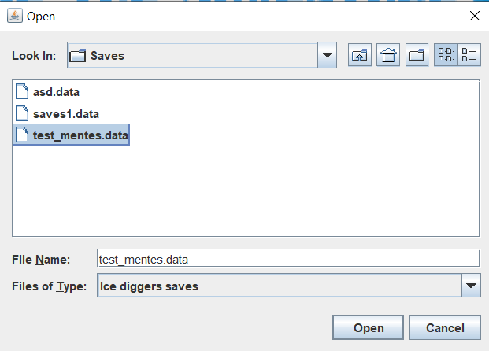

### __A visszatöltött játékállapot:__
 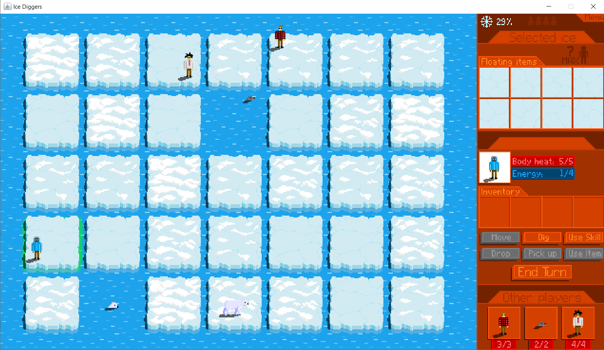


### __Megjegyzés:__

```
A teszt helyesen lefutott. A visszatöltés után pontosan a lementett állapotot kaptuk vissza.
```
***

## __6 - Jegesmedvék mozgása__

### __A játék visszatöltése:__
 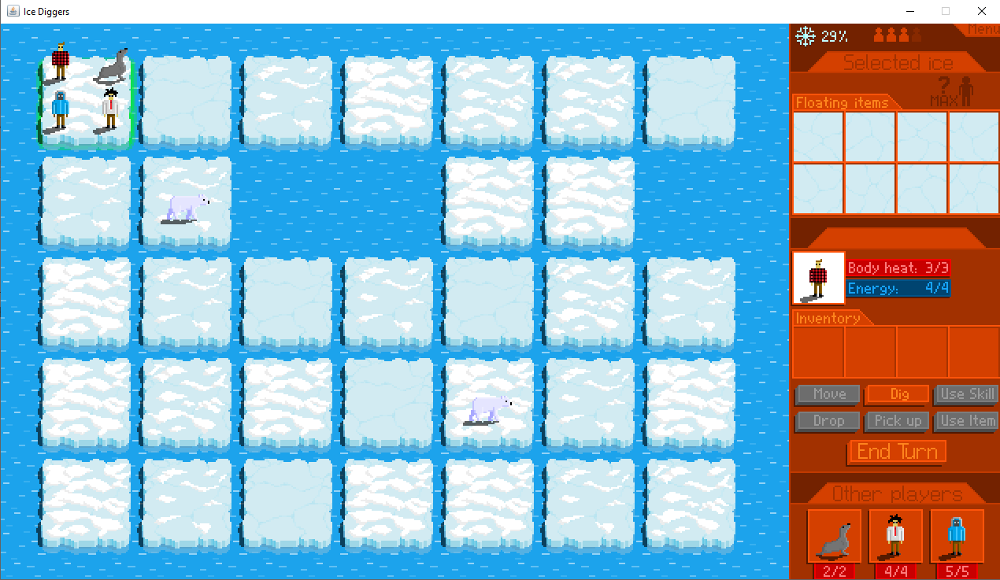

### __A visszatöltött játékállapot:__
 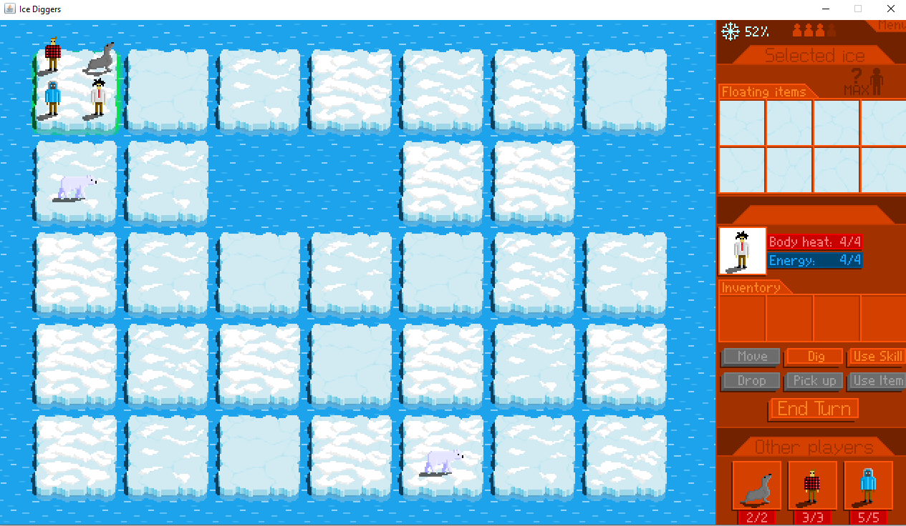


### __Megjegyzés:__
```
A teszt helyesen lefutott. A medvék a kör végén átléptek egy szomszédos mezőre.
```
***

## __7 - Találkozás egy jegesmedvével__

### __A teszt végén megjelent képernyő:__
 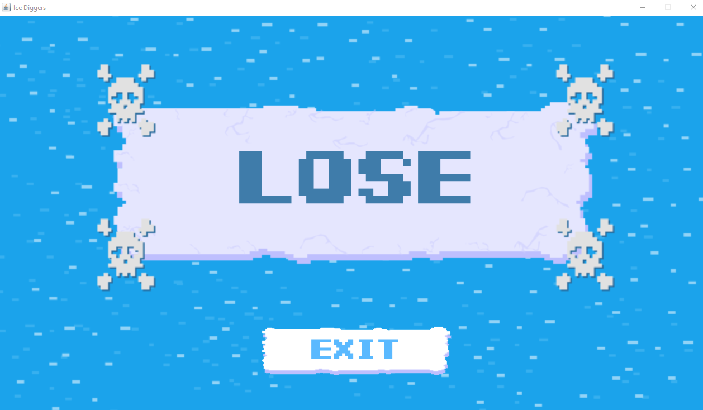


### __Megjegyzés:__
```
A teszt helyesen lefutott. Az egyik medvéhez navigálva a játék végetért, vesztettünk.
```
***

## __8 - Ásás__

### __Játék képe a teszt előtt:__
 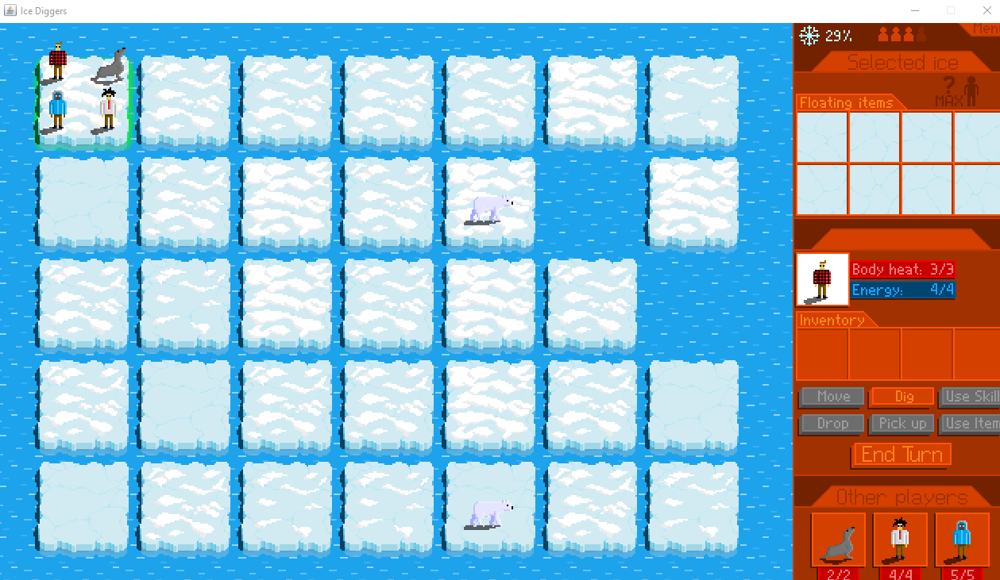

### __Játék képe a teszt után:__
 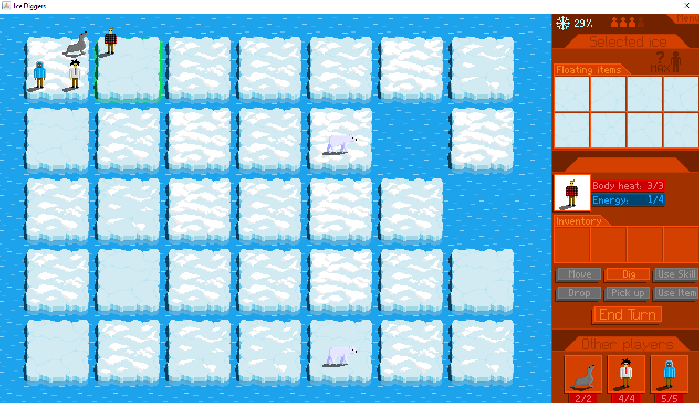


### __Megjegyzés:__
```
A teszt helyesen lefutott. A kiválasztott mezőn az ását követően minden fehér folt (hóréteg) eltűnt.
```
***

## __9 - Eszközök kiásása__

### __Játék képe a teszt után:__
 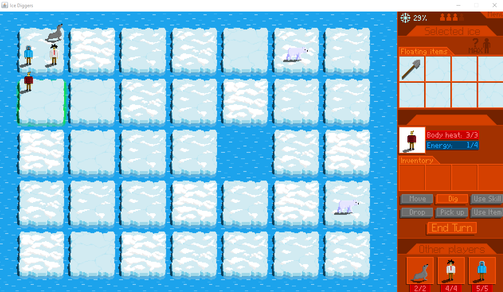


### __Megjegyzés:__
```
A teszt helyesen lefutott. A kiválasztott mezőn az ását követően bekerült egy eszköz a jégtáblához tartozó Floating items-be.
```
***

## __10 - Eszközök felvétele__

### __Játék képe a teszt után:__
 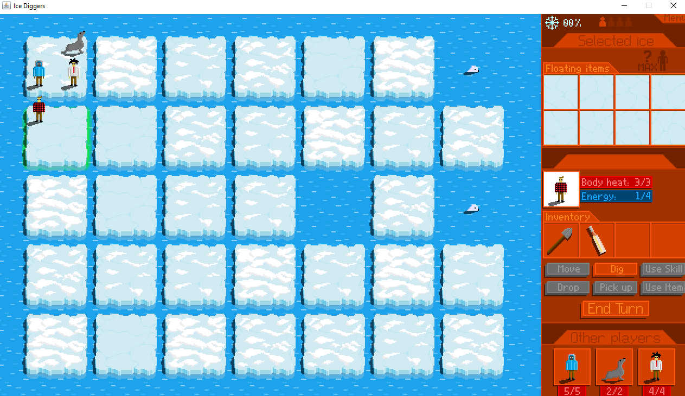


### __Megjegyzés:__
```
A teszt helyesen lefutott. A kiválasztott mezőn az ását követően megjelent eszközök átkerültek az aktuális játékos Inventory-jába.
```
***

## __11 - Eszközök használata__

### __Játék képe a teszt előtt:__
 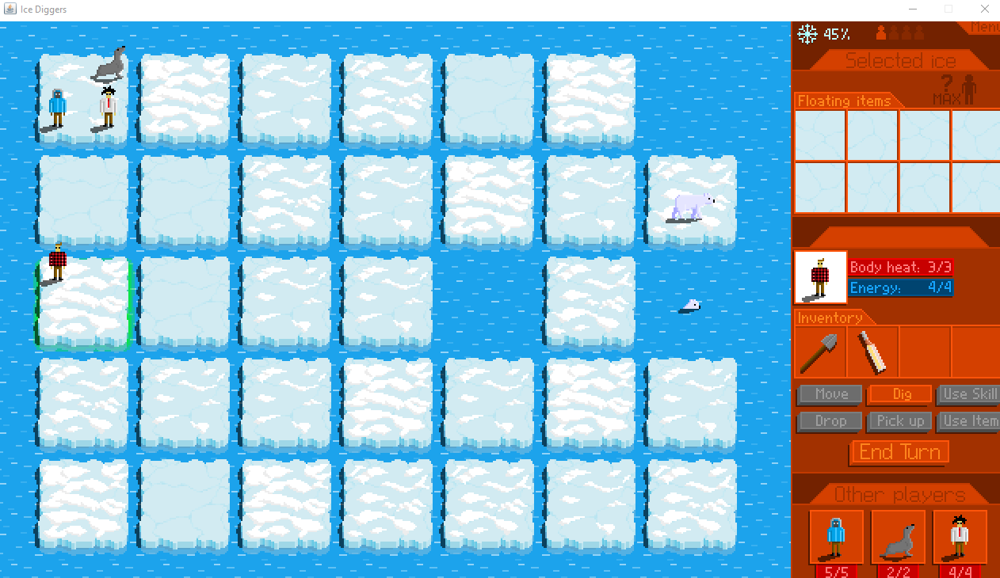

### __Játék képe a teszt után:__
 


### __Megjegyzés:__
```
A teszt helyesen lefutott. Az eszköz kijelölését és használatát követően, maga az eszköz kikerült a játékos Inventory-jából.
```

***

## __12 - Eszköz lerakása__

### __Játék képe a teszt előtt:__
 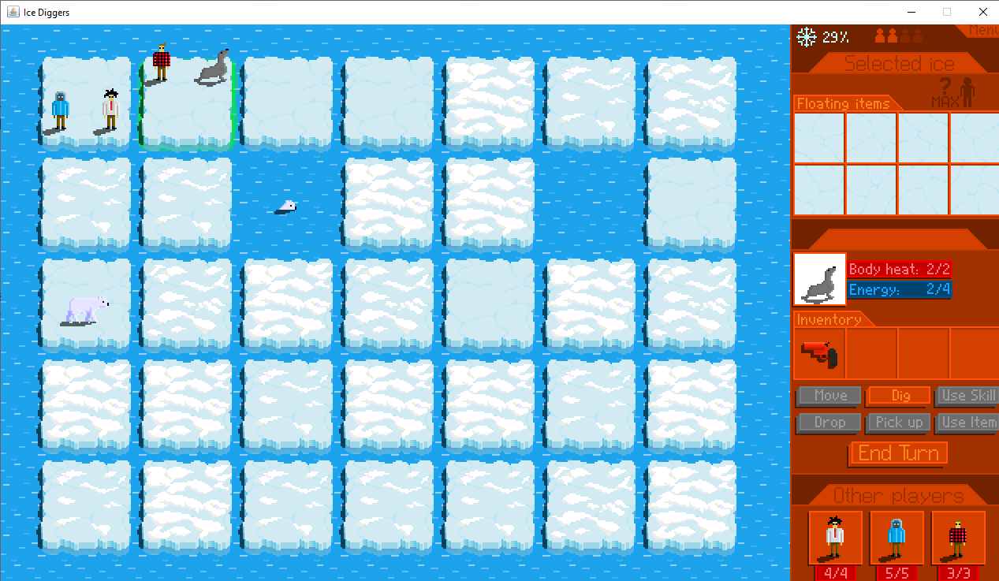

### __Játék képe a teszt után:__
 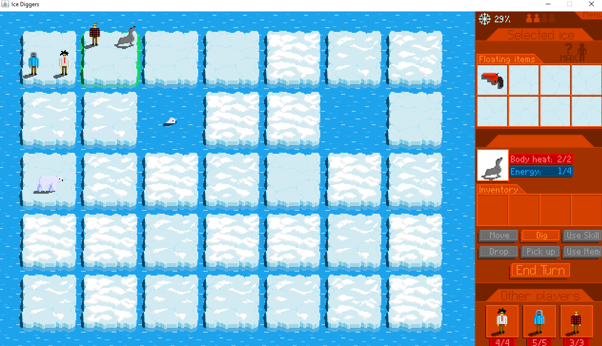


### __Megjegyzés:__
```
A teszt helyesen lefutott. Az eszköz kijelölését és lerakását követően az eszköz visszakerült a jégtáblára.
```
***