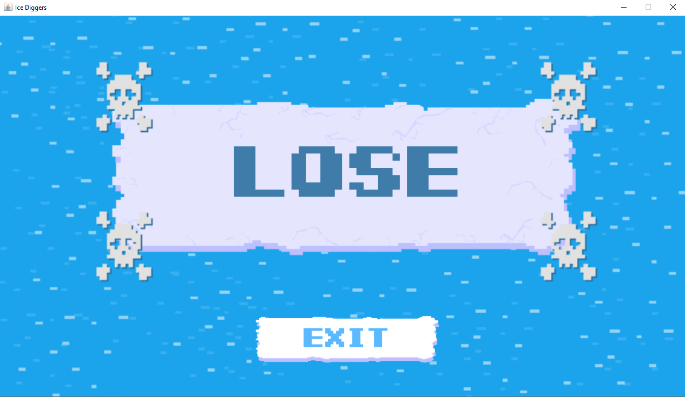

# Manual tests

## __1 - Pálya inicializáció ellenőrzése__

Annak ellenőrzése, hogy a pálya és a pályához tartozó nézet helyesen felépült, a megjelenítés jól működik.

### __Előkészítés__
1. Indítsa el a játékot

### __Teendők__
1. A megjelenő menüben válassza a `NEW GAME` opciót

### __Elvárt kimenet__

A képernyőn az alábbi képnek kell megjelennie. Különbség csak az egyes jégtáblákat borító hó rétegeinek számában és a két jegesmedve elhelyezkedésében lehet.

***

## __2 - Játékosok és körök váltakozása__

Annak ellenőrzése, hogy egy játékos munkavégzésének tényéről, illetve az aktuális játékosról kapunk-e visszajelzést. 

### __Előkészítés__
1. Végezze el a  `1 - Pálya inicializáció ellenőrzése` nevű tesztet

### __Teendők__
1. A játék jobb oldalán, a narancssárga mezőben, a középső részen, az `Inventory` felirat felett látható az aktuális játékos, ennek megjelenését ellenőrizze le.
2. Ellenőrizze, hogy az említett menü alső részén, az `Other players` opció alatt megjelentek-e az aktuális játékoson kívűl  a játékosok képei.
3. A menü felső részén, a középső ikonoknál ellenőrizze, hogy a látszik, hogy hány játékos van még hátra az adott körben.
4. Végezze el a `3 - Játékosok mozgásának megjelenítés` nevű tesztet.
5. Figyelje meg, hogy az aktuális játékos képe mellett az elvégezhető munkák (`Energy`) száma csökkent-e eggyel.
6. Kattintson az akció gombok alatt az `End Turn` gombra.

### __Elvárt kimenet__

A játékos mozgatása után a képe melletti hátralévő munkák számának eggyel csökkennie kellett.

Az `End Turn` megnyomása után az aktuálisan kiválasztott játékos képe meg kell, hogy változzon, méghozzá az `Other players`-nél a bal szélső játékos képére. 

Ezután az `Energy` értéke ismét maximális kell, hogy legyen, illetve a menü felső, középső részén a hátralévő játékosok száma eggyel kell, hogy csökkenjen.

_Megjegyzés: Ha az `End Turn` gombot négyszer egymás után megnyomjuk, akkor a játékosok sorrendje átrendeződik, és a kör újraindul._

_A játékosok az alábbi módon vannak jelölve:_

***

## __3 - Játékosok mozgásának megjelenítése__

Annak ellenőrzése, hogy egy játékos mozgatása megfelelően frissíti-e a nézetet.

### __Előkészítés__
1. Végezze el a  `1 - Pálya inicializáció ellenőrzése` nevű tesztet

### __Teendők__
1. Jelenleg minden játékos a bal-felső sarokban megjelenő jégtáblán áll. Mivel a játékosok mindig csak szomszédos mezőkre mozgathatóak, ezért kattintással jelölje ki az aktuális jégmező jobb vagy alsó szomszédját.
2. Ellenőrizze, hogy biztosan nem olyan mezőt jelölt ki, amelyen már egy jegesmedve áll, ellenkező esetben válasszon ki egy másik mezőt.
3. Az előzőekben már említett `Inventory` alatt találhatóak a funkciógombok, ezek közül válassza ki a `Move` feliratú gombot.   

### __Elvárt kimenet__

A szomszédos jégmező kijelölésekor a jégmező körül egy zöld margó jelent meg. Ez jelzi az aktuálisan kijelölt mezőt.

A kijelölés megszűnt a kezdő mező körül.

A `Move` megnyomása után a korábban beazonosított aktív játékos átkerült az újjonnan kijelölt mezőre.

A kezdő mezőről eltűnt az aktív játékos.

_A mezők/jégtáblák az alábbi módon vannak jelölve:_

***

## __4 - A játék mentése__

Annak ellenőrzése, hogy a játék bármely állapotában megvalósítható az aktuális állapot lementése.

### __Előkészítés__
1. Végezze el a `1 - Pálya inicializáció ellenőrzése` nevű tesztet

### __Teendők__
1. A `3 - Játékosok mozgásának megjelenítése` nevű tesztnél leírtakkal összhangban léptesse át mind a négy játékost bármely más mezőkre, akár különböző helyekre. A mozgatáskor válasszon olyan mezőket, ahol nem tartózkodik jegesmedve.
- Minden játékossal négyszer léphet egy kör lefutása alatt, így összesen négyszer válthat mezőt egy játékossal közvetlenül egymás után.
- A korábban már említett `Inventory` felirat felett láthatja az aktuálisan soron következő játékost.
- Ha nem szeretne a játékosokkal többször egymás után lépni, akkor a már említett akció gombok alatt lévő `End Turn` feliratra nyomva léphet át a következő játékosra.
2. A jobboldali narancssárga hátterű menü jobb legfelső sarkában található `Menu` feliratú gomb segítségével lépjen ki a főmenübe és kattintson a `SAVE` opcióra.
3. A megjelenő ablakban válassza ki a fájl mentésének helyét és a fájl nevét.
4. A `Files of Type` mezőt hagyja az alapértelmezett értéken, ami `Ice diggers save`.
5. Majd kattintson a megjelent ablakban a `Save` gombra.

### __Elvárt kimenet__

Ezután, ha a gép fájlkezelőjével elnavigálunk a kiválasztott mentési helyre, akkor ott látnunk kell az általunk elnevezett fájlt `.DATA` kiterjesztéssel.

***

## __5 - A játék visszatöltése__

Annak ellenőrzése, hogy a játék bármely állapotában megvalósított mentés visszaállítható-e.

### __Előkészítés__
1. Végezze el a `4 - A játék mentése` nevű tesztet

### __Teendők__
1. Indítsa el az alkalmazást, ha még nem futna.
2. A főmenüben válassza ki a `LOAD` opciót.
3. A megjelenő dialógusban navigáljon el az előző tesztben lementett fájlhoz és válassza ki azt.
4. A fájl kiválasztása után kattintson a dialógusban az `Open` gombra.

### __Elvárt kimenet__

Ezután, meg kell jelennie a játéktérnek és __pontosan__ azt az elhelyezkedést kell látnunk, mint, amit korábban lementettünk.

***
## __6 - Jegesmedvék mozgása__

Annak ellenőrzése, hogy az egyes körök végén a jegesmedvék megváltoztatják-e a helyüket

### __Előkészítés__
1. Végezze el a  `1 - Pálya inicializáció ellenőrzése` nevű tesztet

### __Teendők__
1. A játék betöltése és a pálya megjelenése után figyelje meg, hogy a két jegesmedve hol helyezkedik el.
2. Az előzőekben ismertetett akciógombok alatt elhelyezkedő `End Turn` gombra kattintson egymás után négyszer.

### __Elvárt kimenet__

A felületen azt kell látnunk, hogy a jegesmedvék átkerültek az eredeti helyükhöz képest egy szomszédos jégtáblára.

_A jegesmedvék az alábbi módon vannak jelölve:_

***
## __7 - Találkozás egy jegesmedvével__

Annak ellenőrzése, hogy ha egy játékos egy mezőre kerül egy jegesmedvével, akkor a játék végetér-e.

### __Előkészítés__
1. Végezze el a  `1 - Pálya inicializáció ellenőrzése` nevű tesztet

### __Teendők__
1. A `3 - Játékosok mozgásának megjelenítése` című tesztben leírtak alapján, navigáljon egy olyan mezőre, ahol már tartózkodik egy jegesmedve.
- Mivel a medvék elhelyezése véletlenszerűen történik, ezért valószínüleg több mozgatásra lesz szüksége.
- Ha csak egy játékossal szeretne folyamatosan haladni, akkor az `End Turn` gombbal léptesse a játékot, addig, amíg a kiválasztott játékos képe meg nem jelenik az oldalsó menüben.

### __Elvárt kimenet__

A jegesmedve mellé navigáláskor a játék végetér, a játékosok veszítenek, ilyenkor az alábbi képernyő kell, hogy megjelenjen.

***

## __8 - Ásás__

Annak ellenőrzése, hogy ha egy játékos ás egy hóborította jégmezőn, akkor a rajta lévő hórétegek száma csökken.

### __Előkészítés__
1. Végezze el a  `1 - Pálya inicializáció ellenőrzése` nevű tesztet

### __Teendők__
1. A `3 - Játékosok mozgásának megjelenítése` című tesztben leírtak alapján, navigáljon egy olyan mezőre, amin fehér foltok jelennek meg, vagyis hó borítja. Egy olyan mezőt válasszon, amin nem tartózkodik jegesmedve.
2. Győződjön meg róla, hogy az aktuális játékos megegyezik azzal a játékossal, akivel a navigálást végezte. (Szükség szerint egy teljes kört hagyjon ki.)
3. Az akció gombok közül nyomja meg a `Dig` feliratú gombot.

### __Elvárt kimenet__

Azon a mezőn, amin az aktuális játékos áll, a fehér foltok (hó rétegek) száma csökkent. Ha többször nyomjuk meg az adott akció gombot, akkor akár teljesen le is tisztíthatjuk a havat, ezt az jelzi, hogy a teljes mező világos kék színű fehér foltok nélkül.

***

## __9 - Eszközök kiásása__

Annak ellenőrzése, hogy ha egy játékos kiás egy adott eszközt a hóból, akkor az megjelenik-e.

### __Előkészítés__
1. Végezze el a  `1 - Pálya inicializáció ellenőrzése` nevű tesztet
2. A `8 - Ásás` nevű teszt alapján tisztítsa le a havat teljesen egy adott mezőről.

### __Teendők__
1. Navigáljunk arra a mezőre, ahonnan letisztítottuk a havat.
2. Győződjünk meg róla, hogy az a játékos az aktuális, akivel odanavigáltunk.
3. Nyomjuk meg az akciógombok közül a `Dig`-t maximum háromszor.
- Sajnos nem minden jégtábla rendelkezik befagyott eszközökkel, így ha a `Floating items`-ben nem jelent meg semmi, akkor navigáljunk át egy új jégtáblára és kezdjük előről.

### __Elvárt kimenet__

Az oldalsó menüben, a `Floating items`-ben megjelent egy eszköz, maguk az eszközök sokfélék lehetnek, az alábbiak közül kell legalább egyet látnunk:

 

***

## __10 - Eszközök felvétele__

Annak ellenőrzése, hogy ha egy játékos kiás egy adott eszközt a hóból, akkor azt át tudja-e emelni a saját tárhyelére.

### __Előkészítés__
1. Végezze el a  `9 - Eszközök kiásása` nevű tesztet

### __Teendők__
1. Navigáljon arra a mezőre, ahol bekerült egy eszköz a `Floating items`-be.
2. Ügyeljen rá, hogy az a jégmező legyen kiválasztva, amin áll az aktuális játékos.
3. A `Floating items`-ben kattintással jelöljön ki egy eszközt.
4. Kattintson az akciógombok közül a `Pick up` feliratúra.

### __Elvárt kimenet__

Az oldalsó menüben, a `Floating items`-ból eltűnt a kiválasztott eszköz és megjelent az aktuális játékos `Inventory`-jában.

***

## __11 - Eszközök használata__

Annak ellenőrzése, hogy miután a felhasználó felvett egy eszközt, azt tudja-e használni.

### __Előkészítés__
1. Végezze el a  `10 - Eszközök felvétele` nevű tesztet

### __Teendők__
1. Az aktuális játékos `Inventory`-jában kattintással jelölje ki a kiválasztott eszközt.
2. Kattintson rá az akciógombok közül a `Use Item` gombra.
- Egyes eszközök csak úgy használhatóak, ha ki van jelölve egy szomszédos jégtábla a pályán (pl.: kötél), illetve egyes eszközöket többször is lehet használni, mielőtt eltűnnének.

### __Elvárt kimenet__

Az aktív játékos `Inventory`-jánól eltűnik az eszköz.

***

## __12 - Eszköz lerakása__

Annak ellenőrzése, hogy miután a felhasználó felvett egy eszközt, azt le tudja-e rakni.

### __Előkészítés__
1. Végezze el a  `10 - Eszközök felvétele` nevű tesztet

### __Teendők__
1. Az aktuális játékos `Inventory`-jában kattintással jelölje ki a kiválasztott eszközt.
2. Kattintson rá az akciógombok közül a `Drop` gombra.

### __Elvárt kimenet__

Az aktív játékos `Inventory`-jánól eltűnik az eszköz és átkerül annak a jégtáblának a `Floating items`-jébe, amin áll a játékos.

