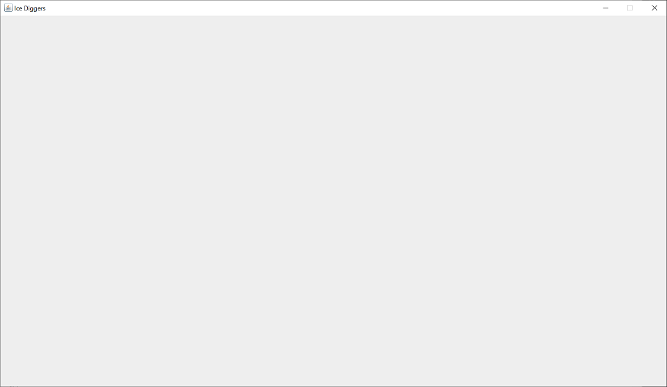
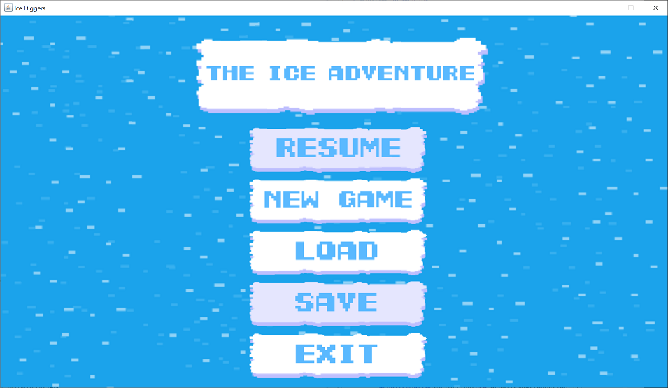
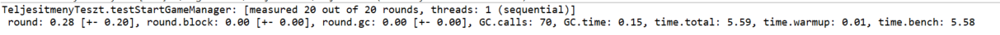

# Nem-funkcionális tesztek

## A játék felület használhatósága

### Játék felhasználói felülete
- Ha a játékot lerakjuk, a tálcára vagy át az ablakot át mozgatjuk egy másik monitorra akkor a játék eltűnik és csak egy kattintás után lehet használni.

-  A játék ablakot nem lehet nem méretezhető ezért túl kicsi vagy túl nagy felbontásnál kényelmetlen a játék használata.

- Nincs lehetőség a régi mentések törlésére és nincs figyelmeztetés, amikor egy régi mentést írunk felűl.
- Nincs vizuális visszajelzés, amikor egy gombot lenyomunk
- A fő menüben a Resume és Save gomb megjeleni a játék kezdetekor, de semmi funkcionális jelentősége nincs, mivel nem lehet őket használni.

- Lehetséges a mentéseket más típusú fájl ként is elmenteni de ezek nem lehet látni azonnal a Load gomb lenyomásával csak ha a fájl keresőben a kereset fájl típust átállítjuk all-ra.
- A játék nem tartalmaz az automatikus mentés, ezért ha a játékmentés nélkül bezárunk, vagy a játék összeomlik, akkor a játék menetünk teljesen elveszik.
# Stressz tesztek

3 különböző típusú stressztesztet végeztünk el:
- Medvék számának növelése
- Játékosok számának növelése
- Tárgyak számának növelése

A tesztekkel a játék elindulásának és betöltésének idejét mértük. Referenciaként egy olyan teszt szolgál, ami a játék elindulási idejét alapbeállítások mellett méri.

Mindegyik tesztet külön futtattuk egy azonos, **5x7** méretű (vagyis **35** mezőből álló) pályán, melyen alapból az első mezőn 4 játékos áll, és a maradék mezőkön 2 medve véletlenszerűen van elhelyezve.

Mivel egy teszt futási ideje változó, minden feltüntetett teszteredmény 5 db teszt futási idejének átlaga. Az idő után az üres teszthez képest mért növekedés van feltüntetve.

**Üres teszt**
- Játék indítása alapbeállítások mellett: `1,309s`

## Medvék számának növelése

**Leírás**  

Ebben a tesztben az egyszerre játékban lévő medvék számát próbáltuk megnövelni. 

Sajnos a játék működése miatt van egy beépített korlátozás a medvék számára vonatkozóan: ha egy medve egy olyan mezőre akar lépni, ahol egy másik medve már áll, másik mezőt kell választania. Ezt addig ismétli amíg egy üres mezőt nem talál. Emiatt a maximális medve szám a mezők számával egyezik meg, így csak ezzel tudtunk tesztelni. Alapból már van két medve, ezért ez a tesztben **33** darab medvét használhatunk.

Ha ezt a maximális számot kihasználjuk, abba a hibába ütközünk, hogy egy medve biztosan rákerül arra a jégtáblára, amin a játékosok állnak. Ebben az esetben a játéknak vége, mivel lehelyezéskor a medve mindig megtámadja az adott mezőn lévő játékosokat. Ez az esemény lehet, hogy az összes medve lerakása (és mgejelenítése) előtt történik meg, ezért a teszt nem valós betöltési időt fog mérni. Ezt elkerülendő, csak a mezők számánál egyel kevesebb medvét rakunk le, és hogy a játékosok mezőjére még így se kerülhessen medve, azzal a mezővel megbontjuk az összes szomszédsági viszonyt, így a medvék nem tudnak véletlenszerűen oda jutni. Tehát a teszt maximum **32** medvét használhat.

**Tesztek**

- Játék indítása 32 db medvével: `1,322s` **+1%**
- Játék indítása 33+ db medvével: `java.lang.StackOverflowError`

**Következtetések**

- A medvék száma (a megengedett tartományon belül) gyakorlatilag nem befolyásolja a töltési időt.

## Játékosok számának növelése

**Leírás**  

Játékosok esetén nincs korlátozás arra, hányan állhatnak egy mezőn, ezért ezzel értelmesebb teszteket lehet végezni.  
A játékosokat a teszt során csak olyan jégtáblákra helyeztük, amelyek kapacitása végtelen. Az olyan mezők is ki lettek hagyva, ahol medve van, ezzel elkerülve a játék elvesztését a teszt futása közben.

**Tesztek**

- Játék indítása jegenként 400 db játékossal: `1,418s` **+8,3%**
- Játék indítása jegenként 400.000 db játékossal: `2,204s` **+68,4%**
- Játék indítása jegenként 1.760.000 db játékossal: `4,444s` **+239,5%**
- Játék indítása jegenként 1.800.000 db játékossal: `java.lang.OutOfMemoryError`

**Következtetések**
- 400.000-ig jól skálázódik a játék.

## Tárgyak számának növelése

**Leírás**  

Kétféle tárgy van a játékban: Frozen és Floating:
- Frozen: jégtáblába van fagyva, nem látszik a UI-n  
- Floating: a jégtábla felszínén van , látszik az UI-n

Mindkét tárgytípus számának növelésére külön teszteket futtattunk.

**FrozenItems Tesztek**

- Játék indítása jegenként 1.000 db fagyott tárggyal: `1,316s` **+0,5%**
- Játék indítása jegenként 100.000 db fagyott tárggyal: `1,534s` **+17,2%**
- Játék indítása jegenként 1.000.000 db fagyott tárggyal: `3,339s` **+155,1%**
- Játék indítása jegenként 1.550.000 db fagyott tárggyal: `8.918s` **+581,3%**
- Játék indítása jegenként 1.560.000 db fagyott tárggyal: `java.lang.OutOfMemoryError`

**FloatingItems Tesztek**

- Játék indítása jegenként 1.000 db lebegő tárggyal: `1,390s` **+6,2%**
- Játék indítása jegenként 100.000 db lebegő tárggyal: `2,030s` **+55,1%**
- Játék indítása jegenként 1.000.000 db lebegő tárggyal: `7,418s` **+466,7%**
- Játék indítása jegenként 1.540.000 db lebegő tárggyal: `22,739s` **+1637,1%**
- Játék indítása jegenként 1.550.000 db lebegő tárggyal: `java.lang.OutOfMemoryError`

**Következtetések**

- A játék kb. 100.000-ig jól skálázódik, utána viszont már nagy töltési idő tapasztalható.
- A két féle tárgytípus közül a FloatinItem-ek hosszabb töltési időt eredményeznek.

# Teljesítmény lemérés

A teljesítmény tesztet a Junit Benchmark segítségével lett tesztelve. A teszt létrehoz egy GameManager objektumot és annak a ViewManager-rén meghívjuk a Update függvényt. A Benchmark a tesztet 20-szor futta le a tesztek.

Itt látható a teszt eredménye

Látható az eredményből hogy egy kör átlagosan 0.28 sec alatt futott le és a teszt futása során 70 alkalommal lett meghívva a Garbage Collector. A teszt teljes futási 5.59 sec volt és ebből 0.01 sec a warmup és a bench 5.58 sec-ig futott.